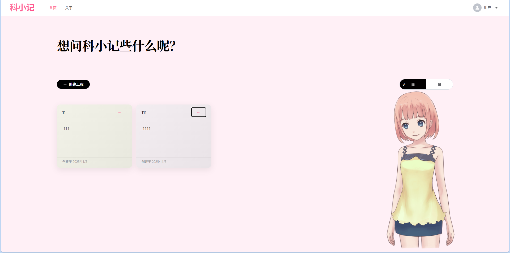
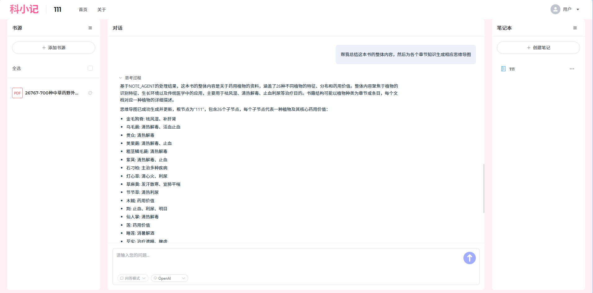
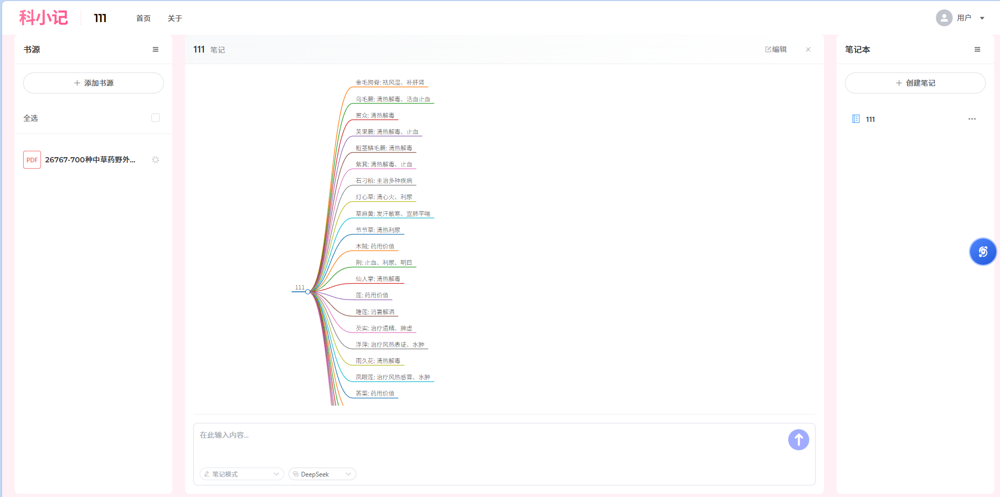

# 📚 科小记 - 智能阅读笔记助手

<div align="center">
  <h3>基于AI的智能阅读笔记和思维导图生成工具</h3>
  

</div>

## 📋 项目概述

科小记是一个智能阅读笔记助手系统，通过AI技术帮助用户轻松整理知识并生成直观的思维导图。项目由三个部分组成：

- **科小记 Frontend** - 基于Vue 3的用户界面
- **科小记 Server** - 基于Spring Boot的后端服务
- **科小记 AGI** - 基于Python FastAPI的智能服务底座

## 📸 功能展示

<div align="center">
  
  <p><i>首页 - 项目管理和文档上传</i></p>
  
  
  <p><i>对话界面 - 思考过程</i></p>
  

  
  
  <p><i>笔记界面 - 笔记管理</i></p>
  

</div>

## ✨ 核心功能
- 🤖 **智能问答** - 自动分析文档内容，结合搜索引擎回答用户问题
- 📝 **智能笔记生成** - 支持多层级生成结构化笔记
- 🧠 **思维导图可视化** - 直观展示知识结构和关系
- 🤝 **多Agent协作** - 基于多智能体协作的复杂任务解决方案
- 💬 **多种AI模型支持** - 支持OpenAI、Qwen、DeepSeek等多种大语言模型
- 📄 **多格式文档支持** - 支持PDF、TXT、DOCX等多种文档格式
- 🔄 **实时交互反馈** - 思考过程实时展示，提供更好的用户体验

## 🛠️ 技术架构

```
readify_parent/
├── readify_frontend/    # 前端项目
├── readify_server/      # 后端服务
└── readify_agi/         # AI智能体底座
```

### 科小记 Frontend

- **技术栈**: Vue 3, TypeScript, Element Plus, Vite, markmap.js
- **功能**: 用户界面

### 科小记 Server

- **技术栈**: Java 17, Spring Boot 3.2.2, MyBatis-Plus, MySQL
- **功能**: 业务端代码实现

### 科小记 AGI

- **技术栈**: Python 3.9, FastAPI, LangChain, OpenAI
- **功能**: AI服务底座，多智能体协调, 文档分析, 知识提取, 思维导图生成

## 🚀 快速开始

### 前提条件

- Node.js 16+
- JDK 17+
- Python 3.9+
- MySQL 8.0+

### 安装步骤

1. **克隆仓库**
```bash
git clone https://github.com/xiaosl-cell/readify_parent.git
cd readify
```

2. **配置后端服务 (科小记 Server)**
```bash
cd readify_server
# 修改数据库配置
vim src/main/resources/application.yml
# 修改以下配置项：
# - spring.datasource.url: 数据库连接地址
# - spring.datasource.username: 数据库用户名
# - spring.datasource.password: 数据库密码
# - jwt.secret: JWT密钥
# - readify.agi.base-url: AGI服务地址
```

3. **配置AGI服务 (科小记 AGI)**
```bash
cd readify_agi
# 修改环境配置
copy .env.example .env
vim .env
# 修改相关api密钥和地址

cd /readify_server
# 修改数据库配置
vim src/main/resources/application.yml
# 修改数据库、agi服务等相关配置
```

4. **启动后端服务 (科小记 Server)**
```bash
cd readify_server
./mvnw spring-boot:run
```

5. **启动AGI服务 (科小记 AGI)**
```bash
cd readify_agi
pip install -r requirements.txt
python main.py
```

6. **启动前端应用 (科小记 Frontend)**
```bash
cd readify_frontend
npm install
npm run dev
```

## 🎎 数字看板娘（Live2D）

前端首页已内置 Live2D 数字看板娘，默认在 `Home.vue` 中启用并渲染到 `#live2dcanvas`。

- **资源位置**: `readify_frontend/public/live2d/`
  - 模型: `assets/Epsilon2.1.model.json` 及其依赖
  - 脚本: `/live2d/device.min.js`, `/live2d/script.js`
- **初始化方式**: `Home.vue` 中动态加载脚本并调用
  ```js
  loadlive2d('live2dcanvas', '/live2d/assets/Epsilon2.1.model.json', 1.0)
  ```
- **交互说明**: 支持拖拽移动、滚轮缩放、双击重置位置与大小
- **关闭/禁用**: 注释 `Home.vue` 中 Live2D 脚本加载与 `<canvas id="live2dcanvas">`，或移除对应 `Promise.all([...])` 逻辑
- **自定义模型**: 替换 `public/live2d/assets` 下的模型文件并调整引用路径

## 🧩 功能模块

### 前端模块

- **用户界面**: 登录注册、项目管理、文件上传
- **笔记系统**: 笔记查看、编辑和管理
- **思维导图**: 交互式知识图谱可视化
- **对话界面**: 与AI进行实时交互问答

### 后端模块

- **用户认证**: 基于JWT的用户认证和权限控制
- **项目管理**: 支持创建和管理多个读书项目
- **文件管理**: 上传、存储和处理文档文件
- **对话历史**: 记录和查询用户与AI的交互历史

### AGI模块

- **智能体协调**: 支持多智能体协作，动态分配任务
- **文档处理**: 文档解析、向量化和语义理解
- **知识问答**: 基于文档内容的智能问答和知识推理
- **笔记生成**: 自动生成和组织文档笔记
